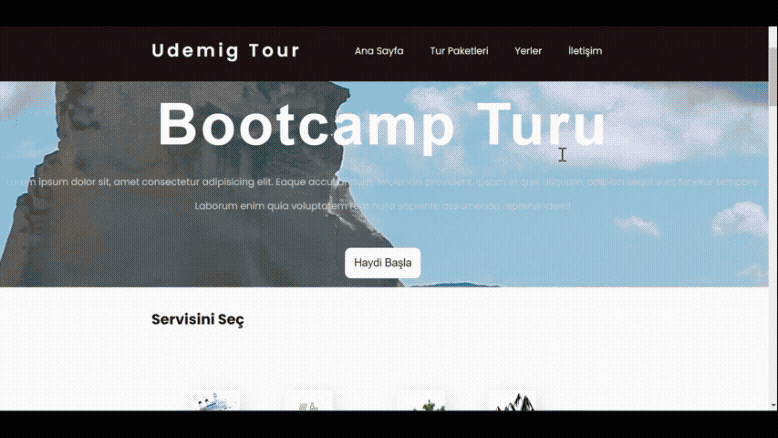

# Udemig Tour Project 🌍

Modern, şık ve kullanıcı dostu bir tatil/tur acentesi arayüzü tasarımı. Bu projede, kullanıcıların tur paketlerini inceleyebileceği, popüler lokasyonları görebileceği ve iletişime geçebileceği tek sayfalık (One Page) bir yapı oluşturulmuştur.

## 🚀 Öne Çıkan Özellikler
* **Modern Header:** Navigasyon linkleri ve kurumsal logo alanı.
* **Hero Section:** Etkileyici bir karşılama metni ve harekete geçirici (CTA) butonu.
* **Servis Kartları:** Gemi turu, dağ yürüyüşü gibi hizmetlerin ikonik gösterimi.
* **Paket Listesi:** Fiyatlandırma, yıldız puanlaması ve lokasyon bilgilerini içeren kart tasarımı.
* **Geniş Footer:** Hızlı linkler ve sosyal medya bağlantılarıyla zenginleştirilmiş alt bilgi alanı.

## 🛠️ Kullanılan Teknolojiler
* **HTML5:** Semantik ve erişilebilir etiket yapısı.
* **CSS3:** * **Flexbox:** Elemanların hizalanması ve düzenlenmesi için.
    * **Responsive Design:** `@media` sorguları ile mobil, tablet ve masaüstü uyumluluğu.
    * **Hover Effects:** Butonlar ve kartlar üzerinde etkileşimli geçişler.
* **FontAwesome:** Sosyal medya ve arayüz ikonları için.

## 📸 Önizleme

---
*Bu çalışma, Udemig eğitim süreci kapsamında temel HTML ve CSS yeteneklerini sergilemek amacıyla geliştirilmiştir.*
